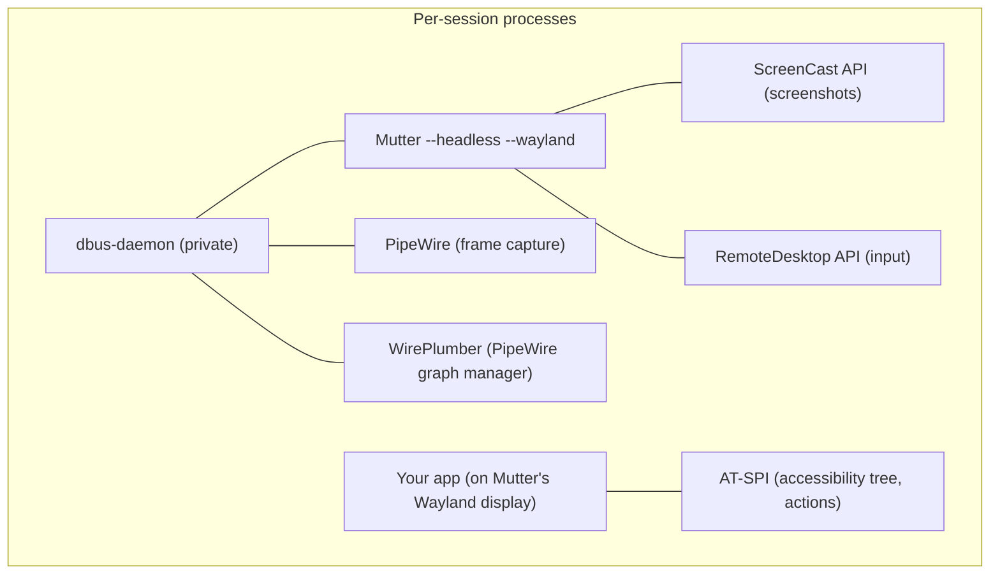
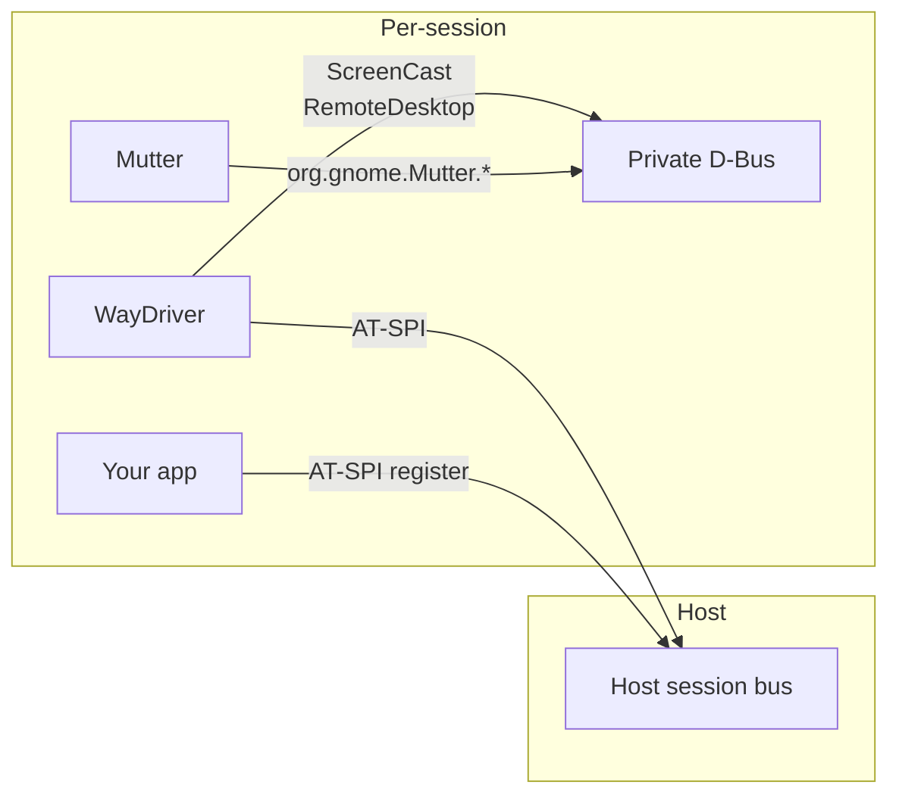
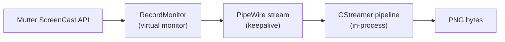

# WayDriver

[](https://github.com/BohdanTkachenko/waydriver/actions/workflows/ci.yml)
[](https://crates.io/crates/waydriver)
[](https://docs.rs/waydriver)
[](LICENSE)

A Rust library for headless GUI application testing on Wayland. Launches apps in isolated compositor sessions, interacts with them via AT-SPI accessibility APIs, and captures screenshots via PipeWire.

The repo also contains `waydriver-mcp`, a standalone MCP server binary built on top of the library that lets AI assistants drive GTK4 apps directly — see [MCP server](#mcp-server) below.

## How it works

Each test session creates an isolated environment with a headless compositor, input injection, and screen capture:



The library is backend-agnostic. Three traits define the interface:

- **`CompositorRuntime`** — lifecycle of a headless compositor (start, stop, expose Wayland display)
- **`InputBackend`** — keyboard and pointer injection
- **`CaptureBackend`** — screen capture (start/stop PipeWire streams, grab PNG frames)

Concrete implementations are separate crates. The trait-based design allows backends to be added as sibling crates without changing the core.

## Backend support

| Feature                        | Mutter                      | KWin | Sway |
| ------------------------------ | --------------------------- | ---- | ---- |
| Headless compositor            | Yes                         | —    | —    |
| Keyboard input                 | Yes (RemoteDesktop)         | —    | —    |
| Pointer input                  | Yes (RemoteDesktop)         | —    | —    |
| Screenshots                    | Yes (ScreenCast + PipeWire) | —    | —    |
| AT-SPI (UI inspection, clicks) | Yes                         | —    | —    |

Currently only Mutter is implemented (`waydriver-compositor-mutter`, `waydriver-input-mutter`, `waydriver-capture-mutter`). Each compositor has its own APIs (Mutter uses `org.gnome.Mutter.*` D-Bus interfaces, KWin has `org.kde.KWin.*`, Sway uses wlroots Wayland protocols), so each would need its own set of backend crates.

## Crate structure

| Crate                         | Purpose                                                                                      |
| ----------------------------- | -------------------------------------------------------------------------------------------- |
| `waydriver`                   | Trait definitions, `Session`, AT-SPI client, keysym helpers, shared GStreamer capture helper |
| `waydriver-compositor-mutter` | `CompositorRuntime` impl — manages Mutter, PipeWire, WirePlumber, private D-Bus              |
| `waydriver-input-mutter`      | `InputBackend` impl — keyboard/pointer via Mutter RemoteDesktop                              |
| `waydriver-capture-mutter`    | `CaptureBackend` impl — screenshots via Mutter ScreenCast + PipeWire                         |
| `waydriver-mcp`               | Binary — MCP JSON-RPC server over stdio that exposes the library to AI assistants            |

## Usage

```rust
use waydriver::{Session, SessionConfig, CompositorRuntime};
use waydriver_compositor_mutter::MutterCompositor;
use waydriver_input_mutter::MutterInput;
use waydriver_capture_mutter::MutterCapture;

let mut compositor = MutterCompositor::new();
compositor.start().await?;
let state = compositor.state();
let input = MutterInput::new(state.clone());
let capture = MutterCapture::new(state);

let session = Session::start(
    Box::new(compositor),
    Box::new(input),
    Box::new(capture),
    SessionConfig {
        command: "gnome-calculator".into(),
        args: vec![],
        cwd: None,
        app_name: "gnome-calculator".into(),
    },
).await?;

// Take a screenshot (returns PNG bytes)
let png = session.take_screenshot().await?;

// Interact via AT-SPI
waydriver::atspi::click_element(
    &session.a11y_connection,
    &session.app_bus_name,
    &session.app_path,
    "5",
).await?;

session.kill().await?;
```

## MCP server

`waydriver-mcp` is a standalone binary that exposes the library over the [Model Context Protocol](https://modelcontextprotocol.io), letting AI assistants (Claude Desktop, Claude Code, etc.) drive GTK4 apps in isolated headless sessions. It speaks JSON-RPC over stdio and constructs the Mutter backends internally — clients only see the high-level tools below.

| Tool              | Purpose                                                          |
| ----------------- | ---------------------------------------------------------------- |
| `start_session`   | Spawn a headless Mutter session and launch a command inside it   |
| `list_sessions`   | List active session ids, app names, and Wayland displays         |
| `kill_session`    | Tear down a session and clean up all child processes             |
| `inspect_ui`      | Dump the AT-SPI accessibility tree of the running app            |
| `click_element`   | Click a widget by its accessible name (via AT-SPI action)        |
| `type_text`       | Type a string into a focused element through the input backend   |
| `press_key`       | Press a named key (`Return`, `Tab`, `Escape`, letters, …)        |
| `find_element`    | Find a widget by accessible name and return its role and path    |
| `move_pointer`    | Move the pointer by a relative offset in logical pixels          |
| `pointer_click`   | Press and release a pointer button (defaults to left click)      |
| `take_screenshot` | Capture a PNG via the keepalive ScreenCast stream and return its path |

### Running with Docker (recommended)

The Docker image bundles all runtime dependencies (mutter, pipewire, wireplumber, dbus, AT-SPI, gstreamer) and starts a container-private D-Bus session, giving each container full isolation from the host.

Prebuilt images are published to [GitHub Container Registry](https://github.com/BohdanTkachenko/waydriver/pkgs/container/waydriver-mcp) for each release:

```sh
docker pull ghcr.io/bohdantkachenko/waydriver-mcp:latest
```

Or build from source:

```sh
docker build -t waydriver-mcp .
```

MCP client config:

```json
{
  "mcpServers": {
    "waydriver-mcp": {
      "command": "docker",
      "args": ["run", "--rm", "-i", "ghcr.io/bohdantkachenko/waydriver-mcp:latest"]
    }
  }
}
```

For running the e2e test suite, build the variant that also includes `gnome-calculator`:

```sh
docker build --build-arg INSTALL_CALCULATOR=true -t waydriver-mcp-e2e .
```

### Running with Nix

The Nix app wraps the raw binary with the required runtime env vars (`GST_PLUGIN_PATH`, `XDG_DATA_DIRS`, `at-spi2-core/libexec`):

```sh
nix run .#mcp
```

Sessions are kept in an in-memory `HashMap` keyed by id, so multiple apps can run concurrently within one server process.

## Requirements

All dependencies are provided by the Nix flake (`nix develop`). If not using Nix, you need the following system packages.

### Build dependencies

| Debian/Ubuntu | Fedora | Arch |
| --- | --- | --- |
| `pkg-config` | `pkg-config` | `pkg-config` |
| `libglib2.0-dev` | `glib2-devel` | `glib2` |
| `libgstreamer1.0-dev` | `gstreamer1-devel` | `gstreamer` |
| `libgstreamer-plugins-base1.0-dev` | `gstreamer1-plugins-base-devel` | `gst-plugins-base` |

### Runtime dependencies

| Debian/Ubuntu | Fedora | Arch |
| --- | --- | --- |
| `mutter` | `mutter` | `mutter` |
| `pipewire` | `pipewire` | `pipewire` |
| `wireplumber` | `wireplumber` | `wireplumber` |
| `gstreamer1.0-plugins-base` | `gstreamer1-plugins-base` | `gst-plugins-base` |
| `gstreamer1.0-plugins-good` | `gstreamer1-plugins-good` | `gst-plugins-good` |
| `gstreamer1.0-pipewire` | `gstreamer1-plugins-pipewire` | `gst-plugin-pipewire` |
| `at-spi2-core` | `at-spi2-core` | `at-spi2-core` |
| `dbus` | `dbus` | `dbus` |

**Quick install:**

```sh
# Debian/Ubuntu
sudo apt install pkg-config libglib2.0-dev libgstreamer1.0-dev \
  libgstreamer-plugins-base1.0-dev mutter pipewire wireplumber \
  gstreamer1.0-plugins-base gstreamer1.0-plugins-good \
  gstreamer1.0-pipewire at-spi2-core dbus

# Fedora
sudo dnf install pkg-config glib2-devel gstreamer1-devel \
  gstreamer1-plugins-base-devel mutter pipewire wireplumber \
  gstreamer1-plugins-base gstreamer1-plugins-good \
  gstreamer1-plugins-pipewire at-spi2-core dbus

# Arch
sudo pacman -S pkg-config glib2 gstreamer gst-plugins-base \
  gst-plugins-good gst-plugin-pipewire mutter pipewire \
  wireplumber at-spi2-core dbus
```

## Architecture notes

### Keepalive ScreenCast stream

In headless mode, Mutter only composites (and delivers Wayland frame callbacks) when a ScreenCast consumer is pulling frames. Without an active stream, GTK4 apps render their first frame but never repaint — the frame clock never ticks.

`Session::start` opens a persistent ScreenCast stream that stays alive for the session's lifetime. This keeps Mutter compositing continuously so frame callbacks flow and GTK4 apps repaint normally.

### Input: RemoteDesktop vs AT-SPI

Two input paths are available, with different trade-offs:

- **RemoteDesktop keyboard/pointer** (`press_keysym`, `pointer_button`) — events go through the full Wayland input pipeline (Mutter -> Wayland protocol -> GDK -> GTK event loop). GTK4 processes them normally and repaints. Use this for interactions that need to produce visible changes.

- **AT-SPI actions** (`click_element`) — directly invoke widget signal handlers by accessible name. Accurate and name-based, but they update GTK4's internal model without triggering compositor redraws. Useful for reading the accessibility tree and programmatic activation, but screenshots taken after AT-SPI-only interactions may show stale frames.

### App isolation

Apps are launched with `GSETTINGS_BACKEND=keyfile` and `XDG_CONFIG_HOME` pointing to the per-session runtime directory. This bypasses the host dconf daemon entirely, so each session starts with default app state and never reads or writes the user's settings.

### Dual D-Bus

GTK4's built-in AT-SPI backend only registers on the host session bus — it ignores custom `DBUS_SESSION_BUS_ADDRESS`. So each session uses two D-Bus connections:

- **Host session bus**: AT-SPI communication with the app
- **Private D-Bus**: Mutter's ScreenCast and RemoteDesktop APIs (isolated from the host compositor)



### Screenshot pipeline



The keepalive stream doubles as the capture source — `take_screenshot` reads frames directly from it via the GStreamer Rust bindings (`gstreamer` + `gstreamer-app` crates).
