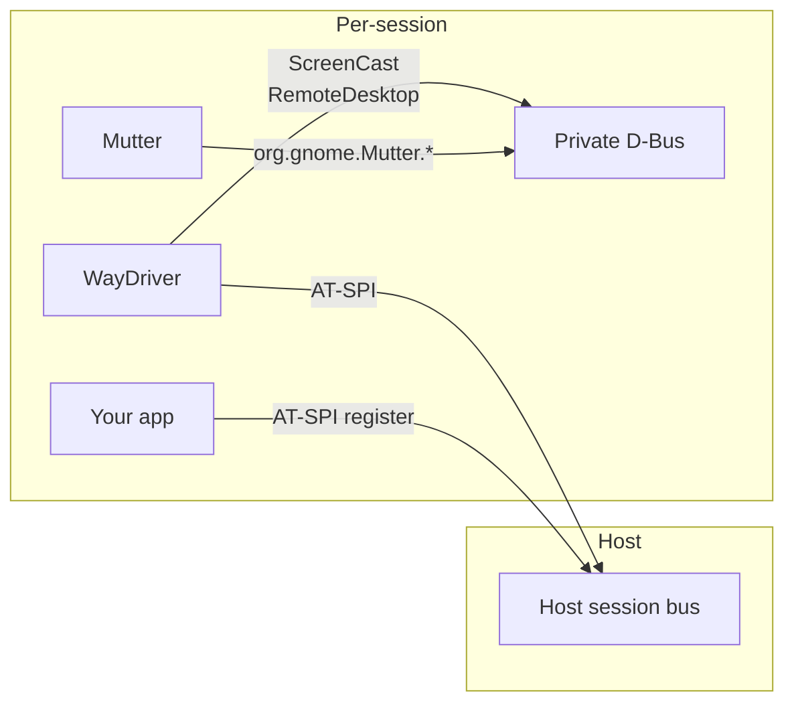
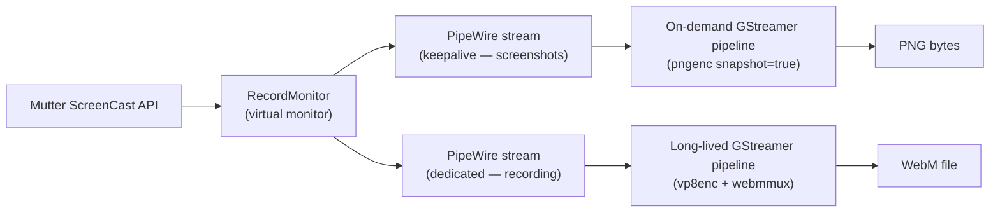

# Architecture Notes

## Keepalive ScreenCast stream

In headless mode, Mutter only composites (and delivers Wayland frame callbacks) when a ScreenCast consumer is pulling frames. Without an active stream, GTK4 apps render their first frame but never repaint — the frame clock never ticks.

`Session::start` opens a persistent ScreenCast stream that stays alive for the session's lifetime. This keeps Mutter compositing continuously so frame callbacks flow and GTK4 apps repaint normally.

## Input: RemoteDesktop vs AT-SPI

Two input paths are available, with different trade-offs:

- **RemoteDesktop keyboard/pointer** (`press_keysym`, `pointer_button`) — events go through the full Wayland input pipeline (Mutter -> Wayland protocol -> GDK -> GTK event loop). GTK4 processes them normally and repaints. Use this for interactions that need to produce visible changes.

- **AT-SPI actions** (`Locator::click()` / `focus()` / `set_text()`) — directly invoke widget signal handlers through the accessibility tree, targeted by XPath. Accurate and precise, but they update GTK4's internal model without triggering compositor redraws. Useful for reading the accessibility tree and programmatic activation, but screenshots taken after AT-SPI-only interactions may show stale frames.

## App isolation

Apps are launched with `GSETTINGS_BACKEND=keyfile` and `XDG_CONFIG_HOME` pointing to the per-session runtime directory. This bypasses the host dconf daemon entirely, so each session starts with default app state and never reads or writes the user's settings.

## Dual D-Bus

GTK4's built-in AT-SPI backend only registers on the host session bus — it ignores custom `DBUS_SESSION_BUS_ADDRESS`. So each session uses two D-Bus connections:

- **Host session bus**: AT-SPI communication with the app
- **Private D-Bus**: Mutter's ScreenCast and RemoteDesktop APIs (isolated from the host compositor)

## External-effect sinks

Some app behaviours leave the process entirely — a desktop notification, a "open this URL" portal request — so they have no AT-SPI projection to query. With `capture_external_effects` enabled, waydriver mocks the daemons that would receive those calls on the app's session bus (`org.freedesktop.Notifications` and `org.freedesktop.portal.Desktop`'s `OpenURI`), records each call, and exposes them via `get_captured_effects` / `Session::notifications()` / `open_uri_requests()`. It's opt-in because the sinks own well-known names — safe on the per-session/container bus, a no-op (with a warning) on a shared host bus that already runs a real daemon.

**Clipboard / PRIMARY-selection readback is not available**: Mutter 46.2 exposes no clipboard D-Bus interface and implements neither `wlr-data-control` nor `ext-data-control-v1`, so there's no out-of-band way to read the selection. The working stopgap is to paste into the app (`Ctrl+V` / middle-click) and read the result back through the AT-SPI `Text` interface (`read_text` / `Locator::text`).

## Screenshot and recording pipeline

Screenshots and recording use **separate** ScreenCast streams. `take_screenshot` spins up a transient pngenc pipeline on the keepalive stream on each call; recording runs a single `vp8enc ! webmmux ! filesink` pipeline for the session's lifetime on its own dedicated stream, flushed with EOS on `Session::kill` so the WebM is seekable. They must not share a node: mutter's screencast node only emits frames on screen damage (`framerate=0/1`), and a continuous recorder consumer would starve a later-attaching screenshot consumer of the initial frame on a static app — so the recorder gets its own stream and the screenshot path stays the keepalive node's first/triggering consumer. Both use the GStreamer Rust bindings (`gstreamer` + `gstreamer-app` crates) and only `gst-plugins-good` (no `-bad`/`-ugly`).
