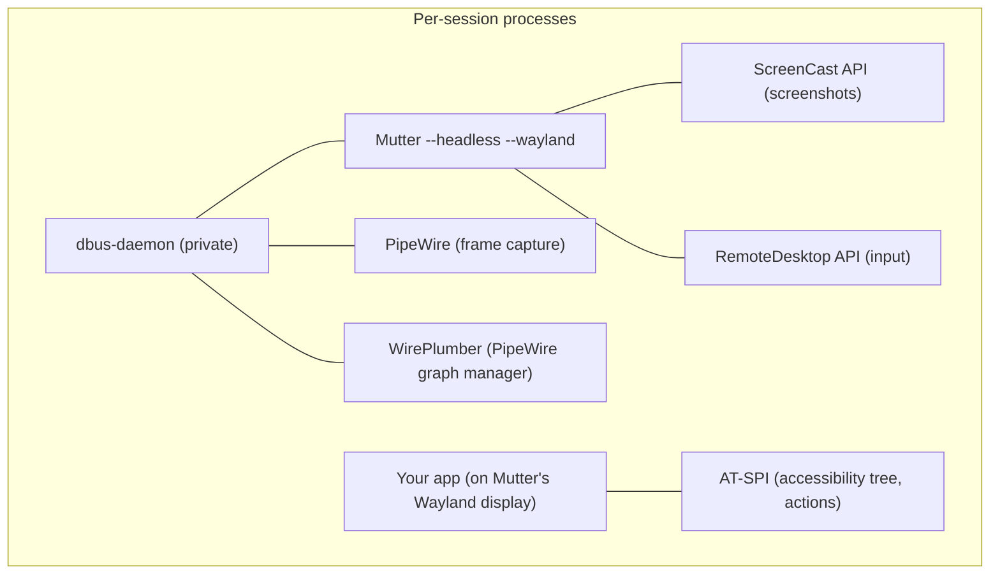

# Introduction

**WayDriver** is a Rust library for headless GUI application testing on Wayland. It launches apps in isolated compositor sessions, interacts with them via AT-SPI accessibility APIs, and captures screenshots and WebM video via PipeWire.

The repo also contains `waydriver-mcp`, a standalone [Model Context Protocol](https://modelcontextprotocol.io) server binary built on top of the library that lets AI assistants drive GTK4 apps directly — see [MCP Server](./guide/mcp-server.md).

[Crates.io](https://crates.io/crates/waydriver)
· [API docs (docs.rs)](https://docs.rs/waydriver)
· [GitHub](https://github.com/BohdanTkachenko/waydriver)
· [License: Apache-2.0](https://github.com/BohdanTkachenko/waydriver/blob/main/LICENSE)

## Demo

The clip below is the full output of [`crates/waydriver-examples/examples/gnome_calculator.rs`](https://github.com/BohdanTkachenko/waydriver/blob/main/crates/waydriver-examples/examples/gnome_calculator.rs), runnable with `cargo run -p waydriver-examples --example gnome_calculator`. Read the source for the API surface in context — it covers a session lifecycle, AT-SPI button clicks, keyboard chord dispatch (`Shift+9`/`Shift+0` for parens), a typed unit conversion, and per-step result verification via XPath locators. The recording is captured by waydriver itself via PipeWire.

<video src="https://github.com/user-attachments/assets/96480250-0e78-4cd7-8228-d5e0620b4ca1" controls width="640"></video>

## How it works

Each test session creates an isolated environment with a headless compositor, input injection, and screen capture:

The library is backend-agnostic. Three traits define the interface:

- **`CompositorRuntime`** — lifecycle of a headless compositor (start, stop, expose Wayland display)
- **`InputBackend`** — keyboard and pointer injection
- **`CaptureBackend`** — screen capture (start/stop PipeWire streams, grab PNG frames)

Concrete implementations are separate crates. The trait-based design allows backends to be added as sibling crates without changing the core.

## Backend support

| Feature                        | Mutter                      | KWin | Sway |
| ------------------------------ | --------------------------- | ---- | ---- |
| Headless compositor            | Yes                         | —    | —    |
| Keyboard input                 | Yes (RemoteDesktop)         | —    | —    |
| Pointer input                  | Yes (RemoteDesktop)         | —    | —    |
| Screenshots                    | Yes (ScreenCast + PipeWire) | —    | —    |
| Video recording (WebM/VP8)     | Yes (ScreenCast + PipeWire) | —    | —    |
| AT-SPI (UI inspection, clicks) | Yes                         | —    | —    |

Currently only Mutter is implemented (`waydriver-compositor-mutter`, `waydriver-input-mutter`, `waydriver-capture-mutter`). Each compositor has its own APIs (Mutter uses `org.gnome.Mutter.*` D-Bus interfaces, KWin has `org.kde.KWin.*`, Sway uses wlroots Wayland protocols), so each would need its own set of backend crates.

## Crate structure

| Crate                         | Purpose                                                                                      |
| ----------------------------- | -------------------------------------------------------------------------------------------- |
| `waydriver`                   | Trait definitions, `Session`, AT-SPI client, keysym helpers, shared GStreamer capture helper |
| `waydriver-compositor-mutter` | `CompositorRuntime` impl — manages Mutter, PipeWire, WirePlumber, private D-Bus              |
| `waydriver-input-mutter`      | `InputBackend` impl — keyboard/pointer via Mutter RemoteDesktop                              |
| `waydriver-capture-mutter`    | `CaptureBackend` impl — screenshots via Mutter ScreenCast + PipeWire                         |
| `waydriver-mcp`               | Binary — MCP JSON-RPC server over stdio that exposes the library to AI assistants            |
